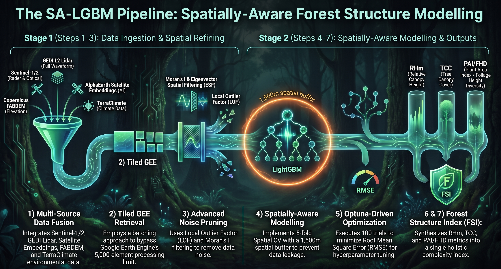

# Spatial-Aware Machine Learning
Herein, a Spatially-Aware LightGBM (SA-LGBM) optimization framework is presented which implements a streamlined Bayesian optimization (Optuna) workflow that incorporates Local Outlier Factor thresholding and Eigenvector Spatial Filtering (Moran's I) with 5-fold Spatial Block Cross-validation to model four distinct GEDI-derived forest structure characteristics using multi-source earth observation (EO) data and synthetic spatial features accross a tropical lancape in Papua New Guinea (PNG). The multi-source EO data is an integration of Sentinel-1 SAR, Sentinel-2 optical imagery, and AlphaEarth Satellite Embeddings with climatic (TerraClimate: precipitation and temperature) and Topographic (Copernicus FABDEM: DEM, slope, and aspect) datasets. 

# Forest Structure Baseline
For demonstration purposes, only canopy height (RHm) and canopy cover (TCC) modelling are provided here from which spatial predictions are derived. Ultimately, a comprehensive forest structure index (FSI) is synthesized from the GEDI multi-metric performance-weighted summation of these forest structure spatial predictions. The FSI acts as an operation landscape metric representing multi-dimentional forest structure variability. It is defined as a forest structure baseline suitable for forest change analysis and aboveground biomass dynamics monitoring. FSI with inidividual canopy height and cover metrics spatially portrayed and compared with the PNG National Forest Inventory (NFI) data via a stratified validation approach, provides the first GEDI-derived spatially-explicit forest structure wall-to-wall mapping effort specific to PNG.

# Highlights
- Introduction of a mean GEDI canopy height metric (RHm)
- Development of Spatially-Aware LightGBM optimization framework (nested Bayesian Optimizer)
  - Local Outlier Factor thresholding
  - Eigenvector Spatial Filtering (Moran's I)
  - 5-fold Spatial Block Cross-validation
- Creation of  a comprehensive forest structure index (FSI) from GEDI multi-metric model predictions
- First spatially-explicit GEDI-derived forest structure wall-to-wall mapping effort specific to PNG

